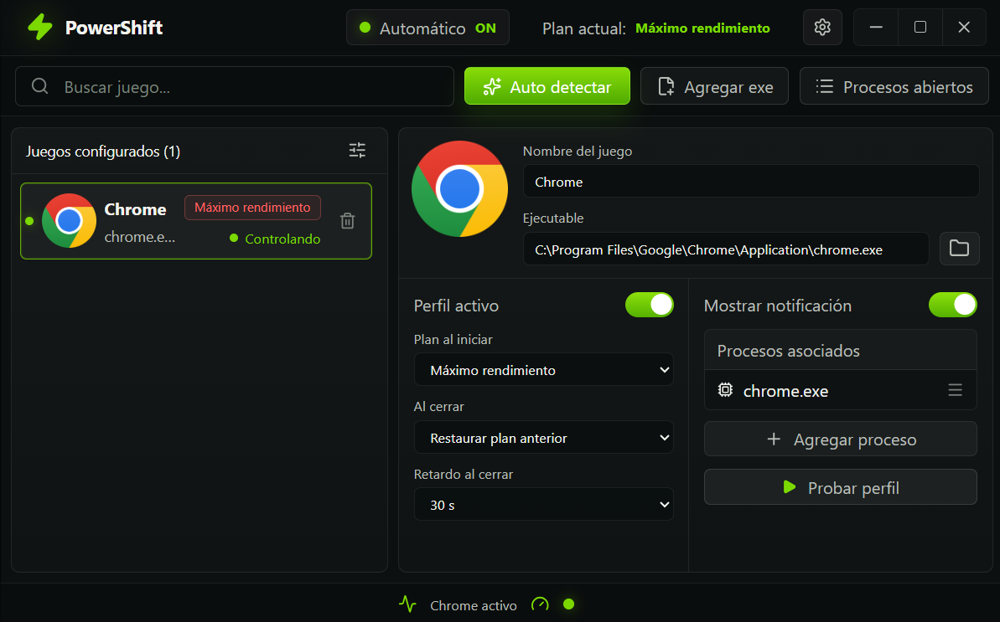

<p align="center">
  
</p>

<h1 align="center">PowerShift</h1>

<p align="center">
  Automatic Windows power plan switching for games and desktop apps.
</p>

<p align="center">
  
  
  
  
  
  
</p>

<p align="center">
  
</p>

## Overview

PowerShift is a native Windows utility that changes the active Windows power
plan automatically when configured games or apps open, then restores the desired
plan when they close.

The goal is simple: keep a gaming PC on a quiet or balanced plan during normal
desktop use, then switch to high performance only when it matters.

## Features

- Automatic power plan switching per configured executable.
- Lightweight Rust agent for background detection and power plan changes.
- Compact Tauri desktop UI for configuration.
- Tray process for opening the UI, notifications, and quick access.
- Manual executable picker and open-process based auto detection.
- Associated process support for launchers, anti-cheat companions, overlays,
  and helpers.
- Per-profile start plan, close behavior, close delay, and notification
  preferences.
- Global notification switch that disables all profile notifications and makes
  new profiles start quiet.
- Event history for diagnostics.
- Elevated scheduled task flow for reliable WMI process events.

## Architecture

PowerShift is split into three executables:

| Component | Purpose |
| --- | --- |
| `powershift.exe` | Tauri UI used to configure profiles and settings. |
| `powershift-agent.exe` | Lightweight Rust agent that watches process events and applies power plans. |
| `powershift-tray.exe` | Tray icon, notifications, and UI launcher. |

The UI is intentionally not the resident worker. When the window is closed or
hidden, the agent and tray keep the automation alive without keeping the WebView
open.

## Detection Model

PowerShift is event-driven. It does not continuously poll the process list in a
tight loop.

Current flow:

1. Windows WMI process events wake the agent.
2. The agent performs a debounced scan only when useful.
3. The scan resolves active profiles using process name, path, or folder rules.
4. The highest-priority active profile controls the power plan.
5. When profiles close, PowerShift restores the configured plan.

Known improvement planned:

- Track active PIDs from scan results.
- Use WMI stop events by PID to wake scans more precisely.
- Keep the current broad close-event fallback only as a safety net.
- Avoid hooks, injection, memory reads, process modification, or direct game
  interaction.

## Installation

Download the latest preview installer from GitHub Releases. Current tag: `v0.1.0-preview`.

Recommended release asset:

```text
PowerShift_0.1.0-preview_x64-setup.exe
```

The installer contains the UI, agent, tray, and scheduled task setup.

> Note: preview builds are not digitally signed yet. Windows SmartScreen may
> show a warning until signed releases are available.

## Development

Requirements:

- Windows 10/11
- Node.js
- Rust toolchain
- Tauri prerequisites

Install dependencies:

```powershell
npm install
```

Run checks:

```powershell
npm.cmd test
cargo test --workspace
cargo clippy --workspace --all-targets -- -D warnings
```

Build frontend, agent, and tray:

```powershell
npm.cmd run build
```

Build the Windows installer:

```powershell
npm.cmd run tauri -- build
```

Generated installer:

```text
target/release/bundle/nsis/PowerShift_0.1.0_x64-setup.exe
```

## Repository Policy

Do not commit generated binaries or build output.

Keep these out of the repository:

- `target/`
- `dist/`
- `node_modules/`
- `*.exe`
- installer artifacts
- local logs

Publish installable builds through GitHub Releases instead.

## Roadmap

- PID tracking for more precise close detection.
- More diagnostics around active profile matching.
- Stronger release packaging and signing.
- More game compatibility testing.
- UI polish and accessibility pass.

## License

PowerShift is licensed under the GNU General Public License v3.0.

GPLv3 was chosen because PowerShift is a desktop application and the project
should remain open when redistributed with modifications. It also requires
copyright and license notices to be preserved. Additional attribution guidance is
included in [NOTICE.md](NOTICE.md).

See [LICENSE](LICENSE) and [NOTICE.md](NOTICE.md).

Copyright (C) 2026 Ismael (`@4ismael1`).
