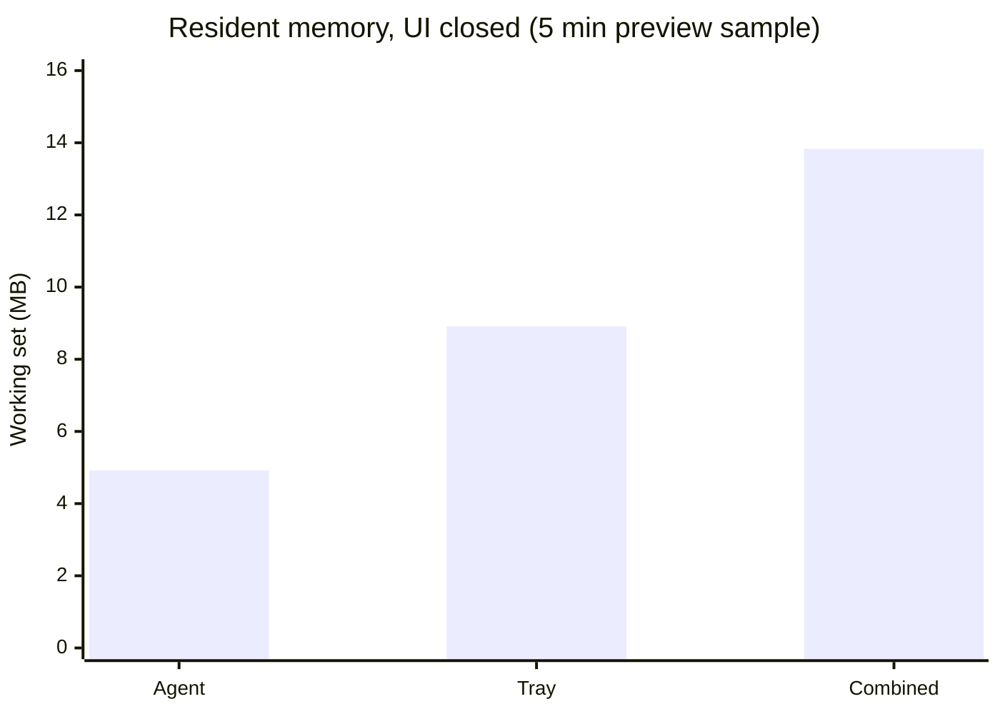

<p align="center">
  
</p>

<h1 align="center">PowerShift</h1>

<p align="center">
  Automatic Windows power plan switching for games and desktop apps.
</p>

<p align="center">
  
  
  
  
  
  
</p>

<p align="center">
  
</p>

## Overview

PowerShift is a native Windows utility that changes the active Windows power
plan automatically when configured games or apps open, then restores the desired
plan when they close.

The goal is simple: keep a gaming PC on a quiet or balanced plan during normal
desktop use, then switch to high performance only when it matters.

## Features

- Automatic power plan switching per configured executable.
- Lightweight Rust agent for background detection and power plan changes.
- Compact Tauri desktop UI for configuration.
- Tray process for opening the UI, notifications, and quick access.
- Manual executable picker and open-process based auto detection.
- Associated process support for launchers, anti-cheat companions, overlays,
  and helpers.
- Per-profile start plan, close behavior, close delay, and notification
  preferences.
- Global notification switch that disables all profile notifications and makes
  new profiles start quiet.
- Event history for diagnostics.
- Elevated scheduled task flow for reliable WMI process events.

## Architecture

PowerShift is split into three executables:

| Component | Purpose |
| --- | --- |
| `powershift.exe` | Tauri UI used to configure profiles and settings. |
| `powershift-agent.exe` | Lightweight Rust agent that watches process events and applies power plans. |
| `powershift-tray.exe` | Tray icon, notifications, and UI launcher. |

The UI is intentionally not the resident worker. Closing the window terminates
the Tauri/WebView process; the agent and tray keep automation alive and reopen a
fresh UI only when requested.

The elevated boundary is explicit: user configuration remains under
`%APPDATA%\PowerShift`, while agent-owned state, diagnostics, and control data
live under `%ProgramData%\PowerShift\users\<SID>`. The runtime directory uses a
high-integrity ACL, and the session-local named pipe is restricted to the exact
Windows user SID with bounded request size and read time. Each Windows account
gets a SID-scoped scheduled task, with no 72-hour execution cutoff and a bounded
restart policy.

Agent state changes wake the tray and an open UI through separate native events,
so the consumers cannot steal notifications from one another. Liveness is
queried on demand through IPC; there is no heartbeat timer or heartbeat disk
write. A slow UI reconciliation timer remains only as a safety net, while the
resident tray performs no periodic polling.

Configuration writes are atomic and preserve the previous valid JSON as a
backup. Both file size and collection counts are bounded before the elevated
agent accepts the configuration. The agent can read the backup without ever
rewriting user-owned `%APPDATA%` data.

## Resource Usage

PowerShift is designed around a simple rule: the background path must stay tiny,
and the heavier interface should only exist while the user is configuring the
app.

In normal use, the resident background footprint is only the Rust agent plus the
tray helper. The Tauri/WebView UI is temporary; closing the window removes the
interface from the steady-state workload.

Preview measurement for `v0.2.0-preview.1` on a Windows desktop during a
representative five-minute desktop session with the UI closed:

| Mode | CPU sample | Working set | Private memory |
| --- | --- | --- | --- |
| Background combined | ~0.078 s over 5 min | ~13.83 MB average | ~4.81 MB average |
| Agent only | ~0.078 s over 5 min | ~4.92 MB average, 7.05 MB max | ~2.94 MB average |
| Tray only | 0 measured over 5 min | ~8.91 MB average, 8.93 MB max | ~1.87 MB average |
| UI tree only | 0 measured over 1 min | ~346.02 MB average | ~154.88 MB average |



The UI figure includes `powershift.exe` plus six Microsoft Edge WebView2
processes. Working set counts shared Chromium pages and is therefore much larger
than private memory. Closing PowerShift terminated the host and all six WebView2
children immediately; only the two small Rust background processes remained.
During the five-minute background sample, `agent-state.json` was not rewritten.

The important behavior is not that the configuration UI uses no memory. It is
that the UI is not the automation engine. Most of the time PowerShift should be
closed to the tray, leaving the low-resource Rust background components active.
These numbers describe the current preview build on one machine, not a universal
benchmark or final ceiling. Continued optimization of the agent, tray, and
process tracking model remains part of the project roadmap.

## Detection Model

PowerShift is event-driven. It does not continuously poll the process list in a
tight loop.

Current flow:

1. At startup, explicit reevaluation, configuration changes, a due restore, or
   degraded WMI, the agent performs one reconciliation snapshot.
2. A WMI start event is prefiltered by configured executable names, then only
   that PID is inspected for its path and creation time. If Windows has not
   made the handle available yet, PowerShift retries that exact PID after 150
   ms and once more after 1 s; it never turns that race into a global scan.
3. Matching instances live in an in-memory registry keyed by `PID + creation
   time`, which prevents PID reuse from corrupting state.
4. Windows thread-pool wait handles report the exit of each tracked instance
   directly. WMI stop events remain a secondary safety signal.
5. The registry is re-evaluated in memory; an unrelated process closing does
   not trigger a whole process-table scan.
6. The highest-priority active profile controls the power plan. Once no
   profiles remain, PowerShift follows the configured restore behavior.

When no deadline or recovery work exists, the agent blocks indefinitely waiting
for an event. The normal path uses no process polling, hooks, injection, memory
reads, process modification, or direct interaction with games or anti-cheat systems.
If WMI is degraded, the agent uses a bounded reconciliation fallback while the
native exit waits keep tracking already-known processes.

## Installation

Download the latest preview installer from GitHub Releases. Current tag: `v0.2.0-preview.1`.

Recommended release asset:

```text
PowerShift_0.2.0-preview.1_x64-setup.exe
```

The installer contains the UI, agent, tray, and scheduled task setup.

> Note: preview builds are not digitally signed yet. Windows SmartScreen may
> show a warning until signed releases are available.

## Development

Requirements:

- Windows 10/11
- Node.js
- Rust toolchain
- Tauri prerequisites

Install dependencies:

```powershell
npm install
```

Run checks:

```powershell
npm.cmd test
cargo test --workspace
cargo clippy --workspace --all-targets -- -D warnings
```

Build frontend, agent, and tray:

```powershell
npm.cmd run build
```

Build the Windows installer:

```powershell
npm.cmd run tauri -- build
```

Generated installer:

```text
target/release/bundle/nsis/PowerShift_0.2.0_x64-setup.exe
```

## Repository Policy

Do not commit generated binaries or build output.

Keep these out of the repository:

- `target/`
- `dist/`
- `node_modules/`
- `*.exe`
- installer artifacts
- local logs

Publish installable builds through GitHub Releases instead.

## Roadmap

- Code signing for trusted publisher and SmartScreen reputation.
- Broader game, launcher, protected-process, and multi-session compatibility
  testing.
- More diagnostics around active profile matching and degraded recovery.
- UI polish and accessibility pass.

## License

PowerShift is licensed under the GNU General Public License v3.0.

GPLv3 was chosen because PowerShift is a desktop application and the project
should remain open when redistributed with modifications. It also requires
copyright and license notices to be preserved. Additional attribution guidance is
included in [NOTICE.md](NOTICE.md).

See [LICENSE](LICENSE) and [NOTICE.md](NOTICE.md).

Copyright (C) 2026 Ismael (`@4ismael1`).
